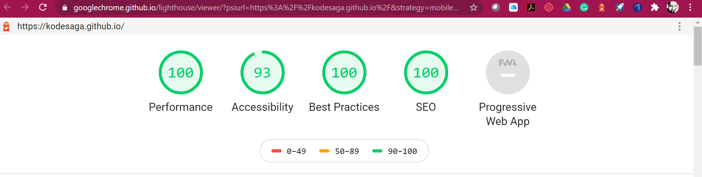

# KodeSaga.github.io
## Shuffle and Sort Fun  [Its Live here. Click to See](https://kodesaga.github.io/)

Finally some time! It's very very early Wednesday and a lot to do. Let's start !!

# Planning

## HTML 

Will keep it simple and as much possible semantic HTML.
Will try to implement dynamic element generation for the numbers via JavaScript.

## CSS

Will be using grids for the overall layouts.
Will try mixing flexbox for the data/numbers and buttons. 
Will experiment with minmax to avoid media queries, fall back due to time constaint will be media queries.
Will also try fluid typography, but not in the first version.

## JavaScript

Will create dynamic elements for the numbers-color combos. 

For shuffle - Will implement in JS the algo logic of Richard Durstenfeld(introduced in 1964). He improvised Fisher–Yates shuffle method for computer use. It's still one of the best.

For sort - The original data which is pre-sorted will be used to escape overhead of re-sorting, this would improve performance in this particular case. I could have used JS in-built sort for the same on the shuffled data, but I would prefer the former for my OCD for performance. 
Will not execute the logic if data is already sorted, will use a Flag to check this. 

## Last - Advaced only for dektop for now!!
For fun, will try to create a click based game where 9 goes missing and a shuffled arrangement is presented and manually users can move tiles to make the grid sorted to win !!

# 1st version. 

## HTML

as planned. 

## CSS

issues with flexbox implemetation, still not as responsive as planned, media queries yet to be added. Flexbox is killing me. Ignoring fluid typography for now.  

Now its a mobile first responsive design, I was trying to avoid media queries, trying some minmax stuff on grids but had to use them in the end.
Fluid typography is another challenge that I need to master.

## JS

as planned. Dynamic element creation, shuffle and sort logic has been implented as imagined. 

Current light house report for the Site

